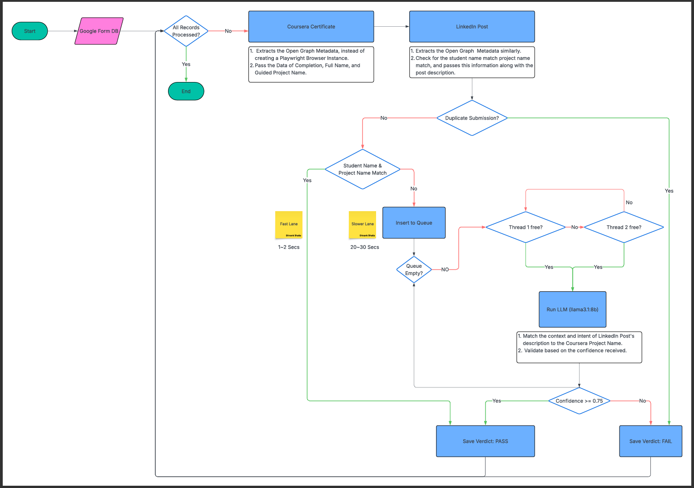

# Coursera Submission Evaluation Pipeline

An automated evaluation pipeline that verifies student Coursera project submissions using LinkedIn post validation, certificate verification, and rule-based credibility checks.
This  Pipeline is designed to help our Course Co-ordinators for faster evaluation of Guided Projects submitted by 500+ students weekly.

---

##  Project Overview

This system automatically evaluates student project submissions by verifying:

- ✅ Coursera Certificate authenticity  
- ✅ LinkedIn post credibility  
- ✅ Student identity verification  
- ✅ Duplicate certificate detection  

---

This project uses a hybrid **AI-assisted + rule-based pipeline** to produce reliable PASS / FAIL decisions, ensuring:

- Avoidance of overly rigid rule-only validation  
- Avoidance of slow and expensive full LLM-driven evaluation  

---

##  Core Features

---

###  Certificate Verification

- Extracts certificate details from Coursera verification pages  
- Uses Open Graph metadata for fast extraction  
- Falls back to browser automation if metadata is unavailable  
- Validates certificate ownership using student name matching  

---

###  LinkedIn Post Analysis

- Extracts LinkedIn post preview metadata using Open Graph tags  
- Collects username, description, and post visibility signals  
- Verifies whether the post references the submitted Coursera project  
- Uses keyword-based contextual matching instead of heavy semantic models  

---

###  Identity Verification

Verifies submission authenticity by cross-checking:

- Coursera certificate student name  
- LinkedIn username  
- LinkedIn post content  

This prevents impersonation and false submission attempts.

---

###  Duplicate Detection

- Tracks certificate links submitted per student roll number  
- Automatically flags repeated certificate submissions  
- Prevents reuse of previously submitted certificates  

---

###  Hybrid Scraping Architecture

The system uses a layered scraping approach for reliability and performance:

**Fast Layer**
- Open Graph metadata extraction  
- HTTP-based scraping  

**Fallback Layer**
- Playwright browser automation for dynamic pages  
- Used when metadata is unavailable or blocked  

---

##  System Architecture

```
Student Submission Dataset
        ↓
Certificate Verification Module
        ↓
LinkedIn Post Analysis Module
        ↓
Identity Verification Layer
        ↓
Duplicate Certificate Detection
        ↓
Rule-Based Credibility Evaluation
        ↓
Final PASS / FAIL Verdict
        ↓
Real-Time Google Sheets Logging
```

---



---

## Technologies Used

- Python  
- Pandas  
- Playwright  
- BeautifulSoup  
- Requests  
- Google Sheets API  
- Multithreading (ThreadPoolExecutor + Queue Architecture)  

---

##  Output System

Results are:

- Streamed live into Google Sheets dashboard  
- Stored locally as CSV backup  
- Logged with multithread-safe processing  

---

##  Performance Design

The pipeline is optimized using:

- Parallel FAST validation workers  
- Background task queue for heavier validations  
- Thread-safe result aggregation  
- Real-time cloud logging  

---
